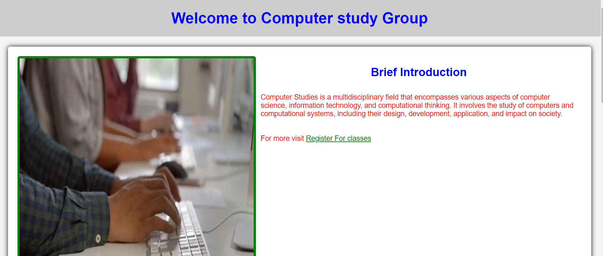
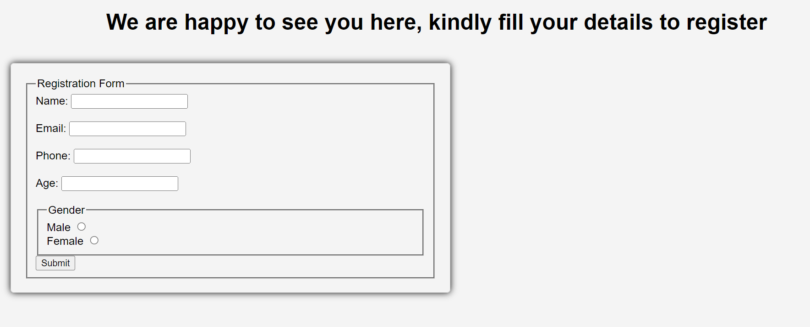
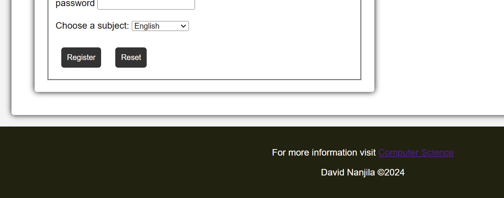

# web-technologies-level-1-hackathon

This event is designed to test your skills in HTML elements, including HTML structure, paragraphs, links, images, forms, and CSS. 

## This is what I have achive
- This screen to show the header part of the web application

- This is the screenshot of the registration form

- this is the screenshot of the footer
